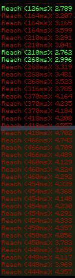

# Statistical Analysis & Proof of Server-side Reach being Elevated with Simulated High Latency

The aim of this repository is to provide the public (n=50) sample of server-side reach
based off different latencies (0ms, 120ms, 200ms, 400ms).

All of the collected data is in the `samples.go` file.

The example code used to collect the data is in `example.go`

Furthermore, the reach data collection was done by using a 10cps
autoclicker to put a bot player in a combo for 50 sample clicks.

The data was collected and then put into a basic one-sample t-test with the null hypothesis being that the reach was equal (or less than) 3.00
while the alternative hypothesis was that reach exceeded 3.00

The results found the found no statistically significance (SS) evidence that reach exceeded 3.00 on the legitimate client
whereas there was SS evidence to suggest the 120ms, 200ms, and 400ms groups had higher server-side reach.

__In simple terms, there is evidence to show that higher latencies generally have higher server-side reach__

## Flaws
Basic flaws with this study were differences in rotation and position of player per knockback which made reach sometimes be legit or not legit. Of course we could always have larger samples and this was just an extremely basic stat. test.

## Media

Credits:
- Response to [The Misconception of Elevated Latency Advantage](https://docs.google.com/document/d/1DWfOcviWsiwFz_gL8H9a8BQA0Sf4gRTYTB2F91fTm2s/edit) by EL1SP.
- T14 Raptor for providing the ray tracing code to allow for server-side reach calculation and his input on the document.
